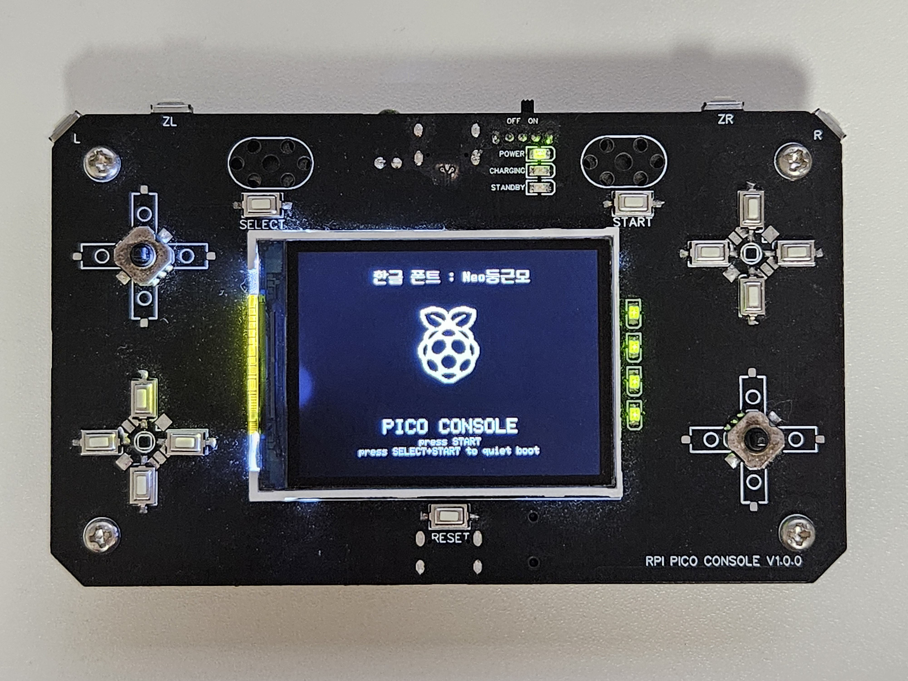
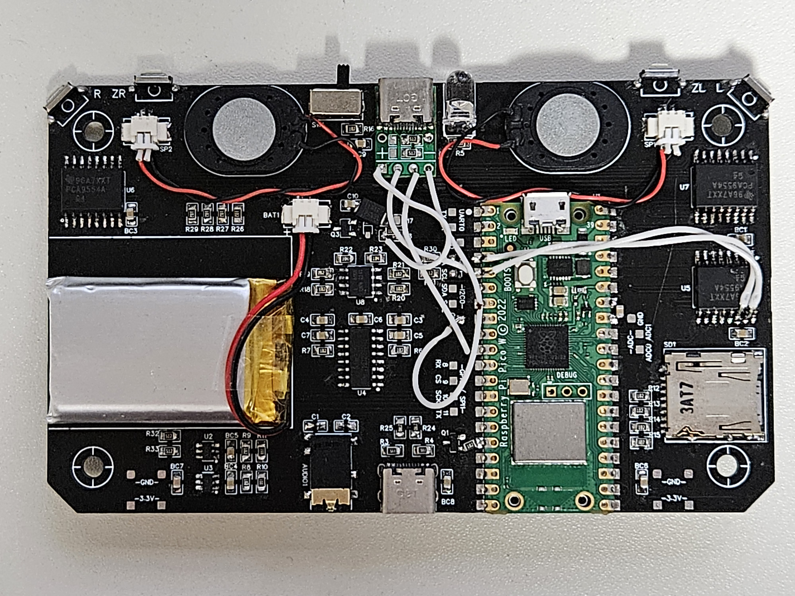

# pico-console

A self-made game console built on the RP2040 microcontroller.  
Runs on bare metal with custom drivers for audio, input, and more.  
Designed for learning and experimenting with embedded systems.

- Graphics: 240x320 16-bit LCD (SPI)
- Audio: 4-channel soft mixing (DAC)
- Input: I2C GPIO expander
- Storage: SPI SD card (wip)
- Other: Battery monitoring, IR (NEC only)

All hardware control and software stack are implemented from scratch without any OS or external frameworks.

## Photos

Back of the console

---

## License

This project is licensed primarily under the **MIT License**.  
It also includes third-party components with the following licenses:

- Portions of the LCD driver are based on the [Adafruit_ILI9340](https://github.com/adafruit/Adafruit_ILI9340)  
  written by Limor Fried/Ladyada for Adafruit Industries, and licensed under the **MIT License**.  
  The required license notice is included directly in the source file.

- Portions of the code are derived from the [Adafruit GFX Library](https://github.com/adafruit/Adafruit-GFX-Library),  
  which is licensed under the **BSD 3-Clause License**.  
  See `licenses/Adafruit-GFX-BSD.txt` for details.

- This project includes the font **"Neo 둥근모"**,  
  available at [github.com/neodgm/neodgm](https://github.com/neodgm/neodgm),  
  which is licensed under the **SIL Open Font License 1.1 (OFL)**.  
  See `licenses/OFL.txt` for the full license text.

- Parts of the LCD driver were originally inspired by a reference implementation by shawnhyam  
  for the Raspberry Pi Pico and the ILI9341 controller.  
  The original repository is no longer available, but it influenced the early structure.  
  All code has since been rewritten and adapted for this project.

- The Raspberry Pi logo and the name "Raspberry Pi" are trademarks of Raspberry Pi Ltd.  
  This project is an independent, non-commercial work and is not affiliated with or endorsed by Raspberry Pi Ltd.
