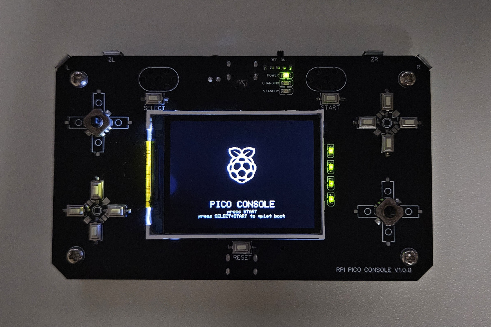

# pico-console



A self-made game console built on the RP2040 microcontroller.  
Runs on bare metal with custom drivers for audio, input, and more.  
Designed for learning and experimenting with embedded systems.

- Graphics: 240x320 16-bit LCD (SPI)
- Audio: 4-channel soft mixing (DAC)
- Input: 24 buttons (uses I2C GPIO expander)
- Storage: micro SD card (SPI interface, SDSC, SDHC, SDXC support)
- Other: Battery monitoring, IR (NEC only)

All hardware control and software stack are implemented from scratch without any OS or external frameworks.

## How to build & upload firmware

1. Install CMake (at least version 3.13), Python 3, a native compiler, and a GCC cross compiler
```
sudo apt install cmake python3 build-essential gcc-arm-none-eabi libnewlib-arm-none-eabi libstdc++-arm-none-eabi-newlib
```
2. Clone this repository and submodules:
```
$ git clone --recurse-submodules https://github.com/Crem2y/pico-console.git
```
3. Launch the build script:
```
./pico_build.sh
```
4. Press the reset button twice to enter bootloader mode.

5. Upload the generated `.uf2` file to your board.

6. (Optional) Launch the clean script to remove build artifacts:
```
./pico_clean.sh
```

## Photos

Back of the console


---

## License

This project is licensed under the MIT License.  
See [LICENSE](./LICENSE) for details.

---

### Third-party components

This project is licensed primarily under the **MIT License**.  
It also includes third-party components with the following licenses:

- **Adafruit_ILI9340** (by Limor Fried / Adafruit), licensed under the **MIT License**.  
  See [github.com/adafruit/Adafruit_ILI9340](https://github.com/adafruit/Adafruit_ILI9340)

- **Adafruit GFX Library**, licensed under the **BSD 3-Clause License**.  
  See `third_party_licenses/Adafruit-GFX-BSD.txt`.

- **Neo 둥근모**, licensed under the **SIL Open Font License 1.1 (OFL)**.  
  See `third_party_licenses/Neo둥근모-OFL.txt`.

- Parts of the LCD driver were originally influenced by a now-deleted Pico + ILI9341 reference by `shawnhyam`.  
  All code has since been rewritten and no original code remains.

- The Raspberry Pi logo and the name "Raspberry Pi" are trademarks of Raspberry Pi Ltd.  
  This project is an independent, non-commercial work and is not affiliated with or endorsed by Raspberry Pi Ltd.

---

- This project uses the **Raspberry Pi Pico SDK**, licensed under the **BSD 3-Clause License**.  
  See `third_party_licenses/pico-sdk-BSD-3-Clause.txt`.

- It includes **TinyUSB**, licensed under the **MIT License**.  
  See `third_party_licenses/tinyusb-MIT.txt`.

- It includes **Mbed TLS**, used under the **Apache License 2.0**.  
  See `third_party_licenses/mbedtls-Apache-2.0.txt`.

- It includes **lwIP**, licensed under the **BSD 3-Clause License**.  
  See `third_party_licenses/lwip-BSD-3-Clause.txt`.

- It includes **cyw43-driver**, licensed under the **BSD 3-Clause License**.  
  See `third_party_licenses/cyw43-driver-BSD-3-Clause.txt`.

- It includes **BTstack**, licensed under the **BSD 3-Clause License with non-commercial restriction**.  
  See `third_party_licenses/btstack-BSD-3-Clause-NonCommercial.txt`.